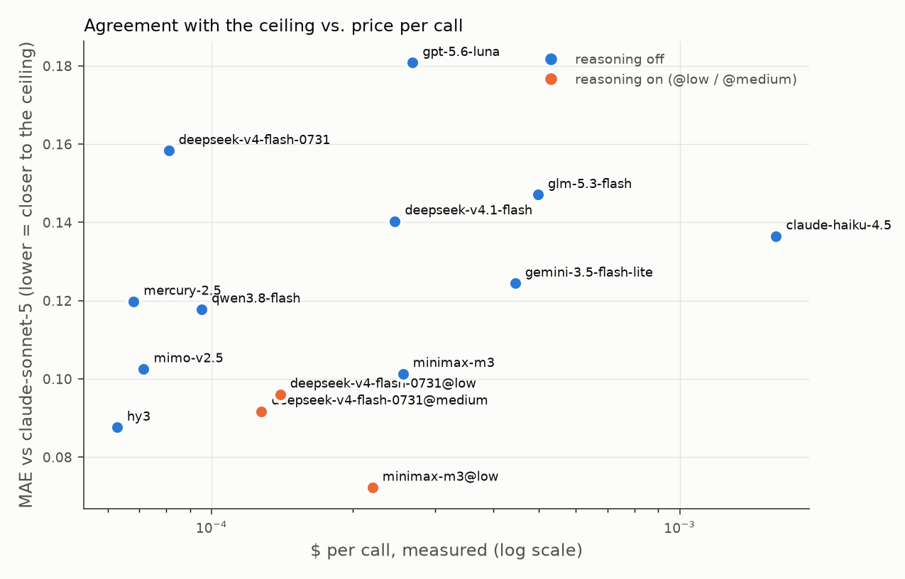
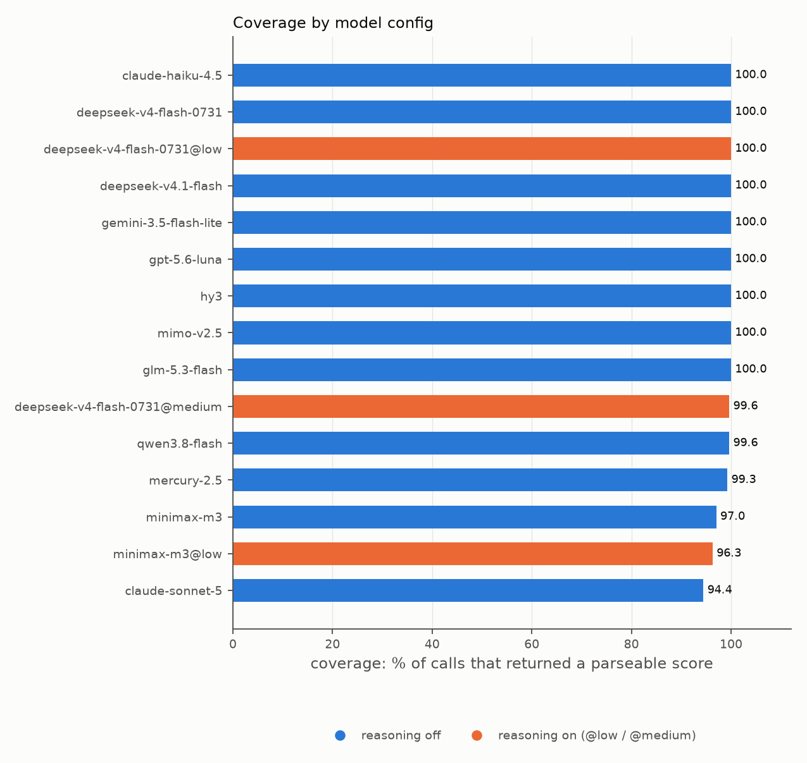

# preprint-judge-bakeoff

Which cheap LLM can triage preprints the way a frontier model would, and how do you know?

This repo scores ~90 recent bioRxiv preprints against a personal **reading profile**
with a dozen models via [OpenRouter](https://openrouter.ai), three repeats each, and
grades every cheap model by how closely it agrees with a frontier **ceiling** model
(Claude Sonnet 5). No human labels: the ceiling is the reference, and the question is
which $0.001 model tracks it.

It is the intern that does the abstract skim for
[Journal Safari](https://www.bubbabrooks.info/blog/tag/journal-safari/), and the
write-up is
[Calibrating a Cheap LLM Judge Against a Frontier Ceiling](https://www.bubbabrooks.info/blog/llm-judge-frontier-ceiling/).

## What it does

```
fetch_preprints.py   bioRxiv API -> data/preprints.json (60 in-lane, 30 deliberately off-lane)
judge.py             the one prompt every model sees, and the parser that decides coverage
harness.py           preprints x models x 3 repeats through OpenRouter JSON mode -> data/results.jsonl
analyze.py           metrics table (results/results.md + .csv), bootstrap CIs, two figures, README sync
agreement.py         chance-corrected agreement: kappa on the >= 0.5 decision, alpha over 0.1 bins, per-category verdicts
disagreement.py      the preprints the usable models split on most -> results/disagreement.md
baseline.py          zero-LLM control: tf-idf cosine(profile.md, title + abstract) as a derived row
ensembles.py         median-of-3 cheap models as derived rows (pre-registered combos only)
```

Metrics, per model config:

| metric             | meaning                                                                                                                          |
| ------------------ | -------------------------------------------------------------------------------------------------------------------------------- |
| **cov%**           | calls that returned a parseable 0-1 score. Timeouts, bad JSON, and empty content count against it.                               |
| **wrong-field**    | calls on an off-lane preprint scored >= 0.5. Counts calls, not preprints: one preprint misjudged on all 3 repeats contributes 3. |
| **sigma**          | mean per-preprint std dev across the 3 repeats. Repeatability.                                                                   |
| **MAE vs ceiling** | mean over preprints of \|model mean - ceiling mean\|. Agreement with the frontier model. The bracket is a 95% bootstrap interval: the 90 preprints resampled with replacement 2,000 times (seed 0), percentile method. |
| **P(<= best)**     | paired bootstrap against the best usable model (lowest MAE at >= 99% coverage): the share of those same 2,000 resamples in which this model's MAE is at or below the reference's. 1.00 for the reference itself; near 0 means the gap is real, near 0.5 means the two are not separable on 90 preprints. |
| **rho**            | Spearman rank correlation between the model's and the ceiling's per-preprint mean scores. Scale-free, so it is the column on which derived rows (`baseline:`) are comparable. |
| **kappa**          | Cohen's kappa between the model's and the ceiling's *decision* on each preprint (score >= 0.5), chance-corrected. 1.0 for the ceiling itself. |
| **alpha**          | Krippendorff's alpha, two raters, scores binned to 0.1 with squared-bin-difference distance (what the cited implementation calls ordinal). n/a for the unscaled baseline. |
| **top-10**         | of the ceiling's 10 highest-scoring preprints, how many are in the model's own top 10. Not bootstrapped: resampling preprints changes what "top 10" means, so this is a point count only. |
| **latency**        | mean wall-clock seconds per call.                                                                                                |
| **$/call**         | mean cost per call as reported by OpenRouter, not the price sheet.                                                               |

## Results

<!-- RESULTS:START -->

Run of 2026-09-11, re-scored 2026-09-12 after the `message.reasoning` fix: 90 preprints x 15
model configurations x 3 repeats = 4,050 calls, $2.19 measured, of which $1.06 was the ceiling.

| model | cov% | strict% | wrong-field | sigma | MAE vs ceiling [95% CI] | P(<= best) | rho | kappa | alpha | top-10 | latency s | $/call |
|---|---:|---:|---:|---:|---:|---:|---:|---:|---:|---:|---:|---:|
| anthropic/claude-sonnet-5 | 94.4 | 97.3 | 0 | 0.011 | 0.000 [0.000, 0.000] | 1.00 | 1.00 | 1.00 | 1.00 | 10/10 | 3.25 | 0.00394 |
| minimax/minimax-m3@low | 96.3 | 91.2 | 1 | 0.057 | 0.072 [0.054, 0.092] | 0.96 | 0.91 | 0.46 | 0.79 | 6/10 | 4.33 | 0.00027 |
| _ens:hy3+deepseek-v4-flash-0731@medium+mimo-v2.5_ | 100.0 | 100.0 | 0 | n/a | 0.085 [0.067, 0.105] | 0.66 | 0.91 | 0.46 | 0.73 | 6/10 | 14.66 | 0.00026 |
| tencent/hy3 | 100.0 | 100.0 | 0 | 0.033 | 0.088 [0.068, 0.109] | 1.00 | 0.89 | 0.36 | 0.72 | 5/10 | 4.22 | 0.00006 |
| deepseek/deepseek-v4-flash-0731@medium | 99.6 | 100.0 | 1 | 0.047 | 0.092 [0.073, 0.112] | 0.35 | 0.90 | 0.54 | 0.70 | 6/10 | 13.89 | 0.00013 |
| _ens:hy3+mimo-v2.5+mercury-2.5_ | 100.0 | 100.0 | 0 | n/a | 0.093 [0.074, 0.113] | 0.20 | 0.91 | 0.36 | 0.68 | 7/10 | 6.78 | 0.00020 |
| deepseek/deepseek-v4-flash-0731@low | 100.0 | 100.0 | 1 | 0.058 | 0.096 [0.077, 0.116] | 0.19 | 0.89 | 0.54 | 0.69 | 6/10 | 16.77 | 0.00014 |
| minimax/minimax-m3 | 97.0 | 100.0 | 1 | 0.054 | 0.099 [0.076, 0.123] | 0.16 | 0.92 | 0.38 | 0.69 | 8/10 | 2.46 | 0.00021 |
| xiaomi/mimo-v2.5 | 100.0 | 100.0 | 2 | 0.065 | 0.103 [0.080, 0.125] | 0.06 | 0.88 | 0.43 | 0.66 | 6/10 | 5.55 | 0.00007 |
| _ens:hy3+gemini-3.5-flash-lite+deepseek-v4.1-flash_ | 100.0 | 100.0 | 0 | n/a | 0.106 [0.087, 0.127] | 0.00 | 0.91 | 0.46 | 0.71 | 9/10 | 6.00 | 0.00075 |
| qwen/qwen3.8-flash | 99.6 | 100.0 | 1 | 0.063 | 0.118 [0.090, 0.149] | 0.00 | 0.87 | 0.33 | 0.61 | 5/10 | 1.89 | 0.00010 |
| inception/mercury-2.5 | 99.3 | 99.6 | 0 | 0.062 | 0.120 [0.099, 0.143] | 0.00 | 0.90 | 0.33 | 0.59 | 6/10 | 0.89 | 0.00007 |
| google/gemini-3.5-flash-lite | 100.0 | 100.0 | 0 | 0.015 | 0.124 [0.096, 0.154] | 0.00 | 0.88 | 0.50 | 0.62 | 7/10 | 1.06 | 0.00044 |
| anthropic/claude-haiku-4.5 | 100.0 | 0.0 | 0 | 0.010 | 0.136 [0.117, 0.158] | 0.00 | 0.90 | 0.50 | 0.65 | 7/10 | 2.35 | 0.00161 |
| deepseek/deepseek-v4.1-flash | 100.0 | 100.0 | 3 | 0.061 | 0.140 [0.116, 0.165] | 0.00 | 0.91 | 0.40 | 0.58 | 8/10 | 4.43 | 0.00025 |
| z-ai/glm-5.3-flash | 100.0 | 97.4 | 0 | 0.035 | 0.147 [0.124, 0.169] | 0.00 | 0.93 | 0.40 | 0.53 | 7/10 | 11.48 | 0.00050 |
| deepseek/deepseek-v4-flash-0731 | 100.0 | 100.0 | 3 | 0.081 | 0.158 [0.135, 0.182] | 0.00 | 0.90 | 0.43 | 0.46 | 6/10 | 4.33 | 0.00008 |
| openai/gpt-5.6-luna | 100.0 | 100.0 | 2 | 0.024 | 0.181 [0.143, 0.222] | 0.00 | 0.93 | 0.25 | 0.43 | 5/10 | 1.80 | 0.00027 |
| _baseline:tfidf_ | 100.0 | 100.0 | 2 | n/a | n/a | n/a | 0.56 | n/a | n/a | 4/10 | 0.00 | 0.00000 |

Among configurations at >= 99% coverage, `tencent/hy3` has both the best agreement and the
lowest price, so it is the reference for the `P(<= best)` column. Read that column before
reading the ranking: the four rows below hy3 (DeepSeek V4 Flash at @medium and @low, MiniMax M3,
MiMo) all land between 0.06 and 0.35, so on 90 preprints hy3 leads them but does not separate
from them. From `qwen/qwen3.8-flash` down the gap is real (P = 0.00). `minimax/minimax-m3@low`
has the lowest MAE in the table and beats hy3 in 96% of resamples, but at 96.3% coverage it is
not usable as-is. `deepseek/deepseek-v4.1-flash` matched the most of the ceiling's own top ten
(8/10) while ranking near the bottom on MAE, which is why both columns are here. The two
MiniMax rows fall short on coverage for a plain reason: the model returns well-formed JSON
with no `fit_score` key in it, across four different providers.

Reproduce with `uv run python analyze.py` against `data/results.jsonl`.

<!-- RESULTS:END -->




## Baselines

Every model in the table has to beat a free method. `baseline:tfidf` scores each preprint by
the cosine between a tf-idf vector of `profile.md` and one of its title + abstract (stdlib
only: tf = 1 + log(count), idf = log((N + 1) / (df + 1)) over the 90 preprints, then min-max to
[0, 1]). It costs nothing, always answers, and its row sits in the table like any other. Its
scale is not a fit score, so its MAE against the ceiling is marked n/a; compare it on **rho**
(Spearman rank correlation with the ceiling's per-preprint means, reported for every row) and
on **top-10**. A model whose rho or top-10 does not clear the baseline is not adding anything
tf-idf would not have. Not tried: sentence-embedding cosine, which would need a dependency this
repo does not have; the "corpus" variant (cosine to the abstracts of past picks instead of the
profile) is the obvious next control.

## Ensembles

Compound judges are the thesis of frameworks like [Verdict](https://github.com/haizelabs/verdict):
instead of one call, aggregate several. The `ens:` rows are the cheapest version of that idea,
computed from scores already in `data/results.jsonl`: per preprint, the **median** of three
models' mean scores. Cost is the three costs summed, latency the slowest of the three, and the
row is unscored wherever any component failed, so its coverage is all-or-nothing. They are
italic in the table and carry `derived = True` in the CSV; the `P(<= best)` reference is
always a single model.

Three combinations are reported, chosen by rule before any ensemble was scored: the best-MAE,
steadiest-sigma and best-top-10 usable models together; the three cheapest usable models; and
the three lowest-MAE usable models from three different labs. There was deliberately no search
over combinations. Picking the best of many ensembles on the same 90 preprints the table is
scored on would be optimistic by construction, and even these three are post-hoc in the sense
that the components were chosen from this table.

## Chance-corrected agreement, by category

MAE rewards a judge that says "no" to almost everything, because the ceiling does too. The
`kappa` and `alpha` columns correct for that chance agreement, and
[`results/agreement_by_category.md`](results/agreement_by_category.md) breaks kappa down by
bioRxiv category (the four in-lane categories, with the off-lane papers pooled) so a judge that
is reliable on genomics and unreliable on microbiology does not hide behind one number. The
verdict rule follows [judgecal](https://github.com/bengodgart/llm-judge-calibration): a
category is **reliable** when kappa >= 0.60 and it holds at least 8 preprints, else not. The
CSV also carries `kappa_top10`, the same statistic on top-10 membership.

## Where the models disagree

MAE says how far a model sits from the ceiling on average. It says nothing about *which*
papers it gets wrong, and those are the ones worth a human's time. [`results/disagreement.md`](results/disagreement.md)
ranks the 90 preprints by the population std dev of the usable models' mean scores (the
same >= 99% coverage set as the table, ceiling excluded), names the model at each extreme
next to the ceiling's own score, and lists the mirror image: the preprints every model
agrees on. Regenerate with `uv run python analyze.py --top-disagreement 10`.

## Run it

```bash
uv sync
export OPENROUTER_API_KEY=...            # or put it in .env and `set -a; source .env`

uv run python fetch_preprints.py         # ~1-3 min; bioRxiv paginates slowly
uv run python harness.py --smoke         # 2 preprints x 1 repeat per model: check every id resolves
uv run python harness.py                 # the full run, resumable; stops starting new configs past --budget
uv run python analyze.py                 # table + figures into results/
uv run pytest                            # pins the metric math
pre-commit install --hook-type pre-commit --hook-type pre-push   # ruff, gitleaks, firewall scan
```

The harness appends one JSON row per call and skips `(model, doi, repeat)` triples that
already exist, so a crashed or budget-stopped run picks up where it left off.

## Point it at your own profile

1. Edit `profile.md`. Say what you read, what you skip, and why. ~200 words is plenty.
2. Edit `IN_LANE` / `OFF_LANE` in `fetch_preprints.py` to bioRxiv categories that match.
   Off-lane papers give the wrong-field metric teeth: keep some.
3. Edit `MODELS` in `harness.py`. Check ids against `https://openrouter.ai/api/v1/models`
   first; the roster here was verified 2026-09-11.

## Method notes

- **Same prompt for every model** (`judge.SYSTEM`): profile + title + abstract in, JSON
  `{fit_score, field, rationale}` out via `response_format={"type": "json_object"}`.
- **Reasoning is off unless the row says otherwise.** OpenRouter's `reasoning`
  parameter: `{"enabled": false}` switches thinking off; `{"effort": "low"|"medium"}`
  turns it up. Some models (DeepSeek V4 Flash) default to ON when the key is omitted,
  so the harness always sends it. Two models refuse the off switch with HTTP 400
  "Reasoning is mandatory for this endpoint": Gemini 3.5 Flash-Lite (which then reports
  0 reasoning tokens anyway) and GLM 5.3 Flash (which does think). Those two run at
  provider default, marked `"default"` in the roster.
- **Per-call timeout is 240 s.** A judge that needs more than four minutes for one
  abstract is not a judge; timeouts count against coverage.
- **max_tokens is 4096 for every call.** Reasoning tokens are billed as completion
  tokens and count against it.
- **Cost is measured, not looked up.** `usage: {"include": true}` makes OpenRouter
  return the cost of each call; `$/call` is the mean over calls that returned.
- **The provider that served each call is recorded, and it matters.** A model id on
  OpenRouter is a routing decision, not a model: the same id is served by several
  providers and they do not all honor the same parameters. In this run one provider
  ignored `reasoning: {"enabled": false}` for MiniMax M3, emitted reasoning tokens
  and returned `content: null` on every call it served, while two others honored it
  and answered normally. `analyze.py` prints coverage per (model, provider) for
  exactly this reason. Pin `provider: {"only": [...], "allow_fallbacks": false}` if
  you need a run to be reproducible.
- **Read the answer out of whichever field it arrives in.** One provider (Parasail, serving
  minimax/minimax-m3) returns the completion in `message.reasoning` and leaves `message.content`
  null, with or without a `reasoning` parameter in the request. Reading only `content` booked 77
  complete answers in this run as coverage failures and scored that model at 79.6% instead of
  97.0%. `harness.unpack` now falls back to `reasoning` and records `content_field`.
- **A parseable score is not clean JSON.** Claude Haiku 4.5 wrapped all 270 of its
  JSON-mode responses in a ` ```json ` markdown fence, so a bare `json.loads()`
  scores it at 0% coverage. `judge.parse` takes the first JSON object in the body and
  records `strict_json` separately; the table reports both.
- The ceiling is scored with the same 3 repeats, so its row shows its own sigma and
  how many "wrong-field" calls the ceiling itself makes.

## Caveats

You are calibrating to a model, not to truth. A cheap judge with MAE 0.05 against the
ceiling inherits every blind spot the ceiling has. The ceiling's own wrong-field count
is the only check on that in this repo, and it is a weak one. Read the post for the
longer version.

## Security

See [SECURITY.md](SECURITY.md) for what the code reads, sends, and never commits.

## License

MIT.
