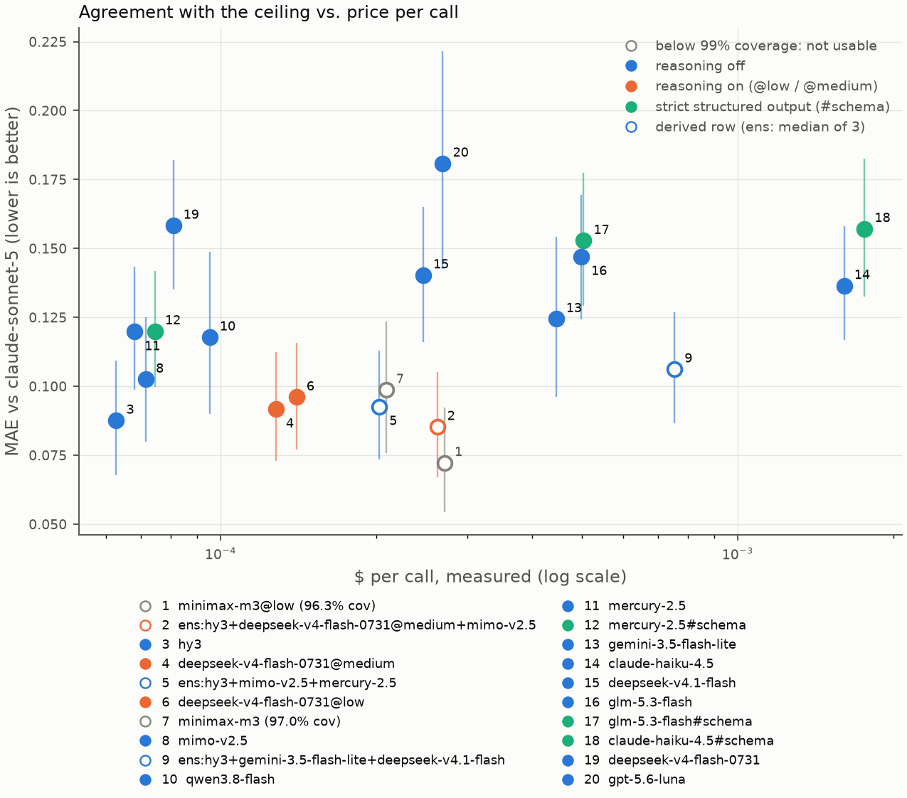
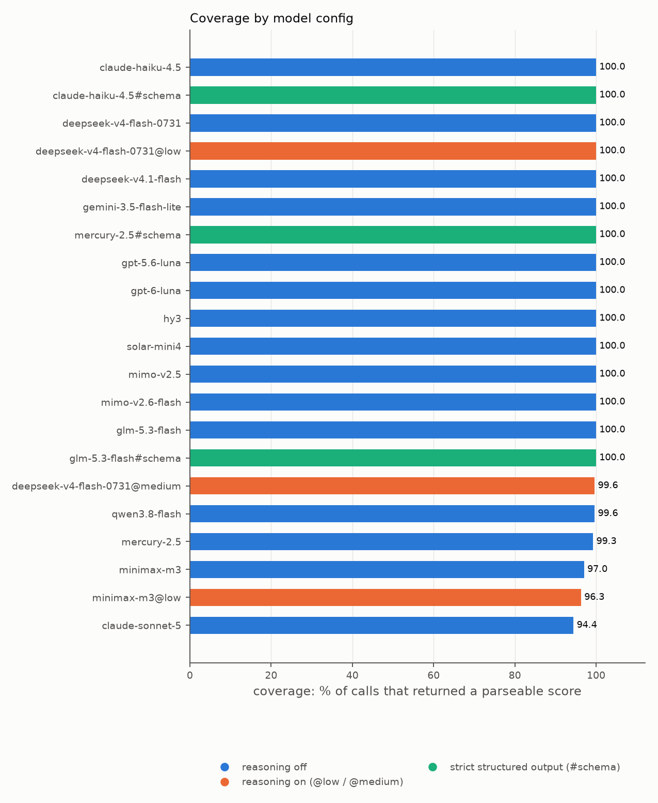

# Results

The table is regenerated between the markers by `uv run python analyze.py`; the prose around it
is not. **Bold** marks the best value in each ranking column among the challengers, as printed
(the ceiling and the zero-cost baseline don't compete); it is the best point estimate, not a
significant win, which is what `P(<= best)` is for. Every column is defined in
[METRICS.md](METRICS.md); in one line each:

| column             | one line                                                                          |
| ------------------ | --------------------------------------------------------------------------------- |
| **cov%** / ladder  | calls with a parseable score; strict / lenient / repaired parser rungs            |
| **unscored**       | preprints with no score in any of the 3 repeats; usable means 0                   |
| **wrong-field**    | off-lane calls scored >= 0.5                                                      |
| **sigma**          | spread across the 3 repeats                                                       |
| **MAE [95% CI]**   | distance from the ceiling, bootstrap interval over preprints                      |
| **P(<= best)**     | paired bootstrap: share of resamples where this row beats the best single model   |
| **rho / kappa / alpha / len rho** | rank, decision and binned agreement with the ceiling; length bias      |
| **top-10**         | how many of the ceiling's top ten the model also shortlisted                      |
| **latency, $/call** | measured, not the price sheet                                                    |

<!-- RESULTS:START -->

Run of 2026-09-11, re-scored 2026-09-12 after the `message.reasoning` fix, three
`json_schema` reruns on 2026-09-13, and three models released since added on 2026-10-03
(MiMo V2.6 Flash, GPT-6 Luna, Solar Mini 4): 90 preprints x 21 model configurations x 3
repeats = 5,670 calls, $2.90 measured, of which $1.06 was the ceiling, $0.63 the reruns and
$0.08 the additions.
Rows suffixed `#schema` ran with strict structured output instead of JSON mode; italic
rows are derived from other rows, not API calls.

| model | cov% | unscored | strict% | ladder strict / lenient / repaired | wrong-field | sigma | MAE vs ceiling [95% CI] | P(<= best) | rho | kappa | alpha | len rho | top-10 | latency s | $/call |
|---|---:|---:|---:|---:|---:|---:|---:|---:|---:|---:|---:|---:|---:|---:|---:|
| anthropic/claude-sonnet-5 | 94.4 | 4 | 97.3 | 91.9 / 94.4 / 95.6 | 0 | 0.011 | 0.000 [0.000, 0.000] | 1.00 | 1.00 | 1.00 | 1.00 | 0.05 | 10/10 | 3.25 | 0.00394 |
| minimax/minimax-m3@low | 96.3 | 0 | 91.2 | 87.4 / 95.9 / 95.9 | 1 | 0.057 | **0.072 [0.054, 0.092]** | 1.00 | 0.91 | 0.46 | **0.79** | 0.08 | 6/10 | 4.33 | 0.00027 |
| _ens:hy3+deepseek-v4-flash-0731@medium+mimo-v2.5_ | 100.0 | 0 | 100.0 | n/a / n/a / n/a | 0 | n/a | 0.085 [0.067, 0.105] | 0.04 | 0.91 | 0.46 | 0.73 | 0.07 | 6/10 | 14.66 | 0.00026 |
| tencent/hy3 | 100.0 | 0 | 100.0 | 100.0 / 100.0 / 100.0 | 0 | 0.033 | 0.088 [0.068, 0.109] | 0.04 | 0.89 | 0.36 | 0.72 | 0.10 | 5/10 | 4.22 | **0.00006** |
| deepseek/deepseek-v4-flash-0731@medium | 99.6 | 0 | 100.0 | 99.6 / 99.6 / 99.6 | 1 | 0.047 | 0.092 [0.073, 0.112] | 0.01 | 0.90 | **0.54** | 0.70 | 0.05 | 6/10 | 13.89 | 0.00013 |
| _ens:hy3+mimo-v2.5+mercury-2.5_ | 100.0 | 0 | 100.0 | n/a / n/a / n/a | 0 | n/a | 0.093 [0.074, 0.113] | 0.00 | 0.91 | 0.36 | 0.68 | 0.07 | 7/10 | 6.78 | 0.00020 |
| deepseek/deepseek-v4-flash-0731@low | 100.0 | 0 | 100.0 | 100.0 / 100.0 / 100.0 | 1 | 0.058 | 0.096 [0.077, 0.116] | 0.01 | 0.89 | **0.54** | 0.69 | 0.07 | 6/10 | 16.77 | 0.00014 |
| minimax/minimax-m3 | 97.0 | 0 | 100.0 | 97.0 / 97.0 / 97.0 | 1 | 0.054 | 0.099 [0.076, 0.123] | 0.00 | 0.92 | 0.38 | 0.69 | 0.07 | 8/10 | 2.46 | 0.00021 |
| xiaomi/mimo-v2.5 | 100.0 | 0 | 100.0 | 100.0 / 100.0 / 100.0 | 2 | 0.065 | 0.103 [0.080, 0.125] | 0.00 | 0.88 | 0.43 | 0.66 | 0.09 | 6/10 | 5.55 | 0.00007 |
| _ens:hy3+gemini-3.5-flash-lite+deepseek-v4.1-flash_ | 100.0 | 0 | 100.0 | n/a / n/a / n/a | 0 | n/a | 0.106 [0.087, 0.127] | 0.00 | 0.91 | 0.46 | 0.71 | 0.10 | **9/10** | 6.00 | 0.00075 |
| qwen/qwen3.8-flash | 99.6 | 0 | 100.0 | 100.0 / 100.0 / 100.0 | 1 | 0.063 | 0.118 [0.090, 0.149] | 0.00 | 0.87 | 0.33 | 0.61 | 0.09 | 5/10 | 1.89 | 0.00010 |
| inception/mercury-2.5 | 99.3 | 0 | 99.6 | 98.9 / 99.3 / 100.0 | 0 | 0.062 | 0.120 [0.099, 0.143] | 0.00 | 0.90 | 0.33 | 0.59 | 0.08 | 6/10 | **0.89** | 0.00007 |
| inception/mercury-2.5#schema | 100.0 | 0 | 99.3 | 99.3 / 99.3 / 99.6 | 0 | 0.057 | 0.120 [0.100, 0.142] | 0.00 | 0.87 | 0.36 | 0.57 | 0.02 | 6/10 | 1.09 | 0.00007 |
| google/gemini-3.5-flash-lite | 100.0 | 0 | 100.0 | 100.0 / 100.0 / 100.0 | 0 | 0.015 | 0.124 [0.096, 0.154] | 0.00 | 0.88 | 0.50 | 0.62 | 0.03 | 7/10 | 1.06 | 0.00044 |
| anthropic/claude-haiku-4.5 | 100.0 | 0 | 0.0 | 0.0 / 100.0 / 100.0 | 0 | **0.010** | 0.136 [0.117, 0.158] | 0.00 | 0.90 | 0.50 | 0.65 | 0.17 | 7/10 | 2.35 | 0.00161 |
| deepseek/deepseek-v4.1-flash | 100.0 | 0 | 100.0 | 100.0 / 100.0 / 100.0 | 3 | 0.061 | 0.140 [0.116, 0.165] | 0.00 | 0.91 | 0.40 | 0.58 | 0.12 | 8/10 | 4.43 | 0.00025 |
| z-ai/glm-5.3-flash | 100.0 | 0 | 97.4 | 97.4 / 100.0 / 100.0 | 0 | 0.035 | 0.147 [0.124, 0.169] | 0.00 | **0.93** | 0.40 | 0.53 | 0.12 | 7/10 | 11.48 | 0.00050 |
| z-ai/glm-5.3-flash#schema | 100.0 | 0 | 99.6 | 99.6 / 100.0 / 100.0 | 1 | 0.033 | 0.153 [0.129, 0.177] | 0.00 | **0.93** | 0.35 | 0.51 | 0.09 | 7/10 | 9.91 | 0.00050 |
| xiaomi/mimo-v2.6-flash | 100.0 | 0 | 100.0 | 100.0 / 100.0 / 100.0 | 2 | 0.042 | 0.154 [0.128, 0.181] | 0.00 | **0.93** | 0.33 | 0.54 | 0.11 | 7/10 | 2.26 | 0.00009 |
| anthropic/claude-haiku-4.5#schema | 100.0 | 0 | 100.0 | 100.0 / 100.0 / 100.0 | 4 | 0.017 | 0.157 [0.133, 0.183] | 0.00 | 0.91 | 0.38 | 0.55 | 0.13 | 7/10 | 2.47 | 0.00176 |
| deepseek/deepseek-v4-flash-0731 | 100.0 | 0 | 100.0 | 100.0 / 100.0 / 100.0 | 3 | 0.081 | 0.158 [0.135, 0.182] | 0.00 | 0.90 | 0.43 | 0.46 | 0.04 | 6/10 | 4.33 | 0.00008 |
| openai/gpt-5.6-luna | 100.0 | 0 | 100.0 | 100.0 / 100.0 / 100.0 | 2 | 0.024 | 0.181 [0.143, 0.222] | 0.00 | **0.93** | 0.25 | 0.43 | 0.17 | 5/10 | 1.80 | 0.00027 |
| openai/gpt-6-luna | 100.0 | 0 | 100.0 | 100.0 / 100.0 / 100.0 | 9 | 0.033 | 0.207 [0.168, 0.248] | 0.00 | 0.92 | 0.20 | 0.36 | 0.13 | 7/10 | 1.90 | 0.00012 |
| upstage/solar-mini4 | 100.0 | 0 | 100.0 | 100.0 / 100.0 / 100.0 | 8 | 0.066 | 0.215 [0.186, 0.246] | 0.00 | 0.83 | 0.23 | 0.21 | 0.11 | 4/10 | 2.19 | **0.00006** |
| _baseline:tfidf_ | 100.0 | 0 | 100.0 | n/a / n/a / n/a | 2 | n/a | n/a | n/a | 0.56 | n/a | n/a | 0.29 | 4/10 | 0.00 | 0.00000 |

A configuration is usable when every preprint gets a score within its three repeats
(`unscored` = 0): a call that fails and then succeeds costs one more call, but a preprint never
scored is a blind spot, and the intern retries twice. Every challenger clears that bar; only the
ceiling does not, with 4 preprints unscored on all three tries. `minimax/minimax-m3@low` has the
lowest MAE, 0.072 [0.054, 0.092], and is the reference for the `P(<= best)` column. It fails
3.7% of single calls (well-formed JSON with no `fit_score` key in it, on two providers),
but never twice on the same preprint. `tencent/hy3` is next among single models at 0.088 and
costs about 4.3 times less per call (measured means $0.0000628 against $0.0002708); it matches or
beats MiniMax in 4% of resamples, but the paired interval on the gap, 0.015 [-0.002, 0.032],
includes zero, and MiniMax is the post-hoc best of twenty: a small edge, not a settled one. Every other row sits at P <= 0.04.
Among single models, `minimax/minimax-m3` and `deepseek/deepseek-v4.1-flash` matched the most of
the ceiling's own top ten (8/10) while ranking well below on MAE, which is why both columns are
here. The three models added on 2026-10-03 all land in the bottom third, and two of them do
worse than the versions they replace (MiMo V2.6 Flash against V2.5, GPT-6 Luna against 5.6).

Reproduce with `uv run python analyze.py` against `data/results.jsonl`.

<!-- RESULTS:END -->

